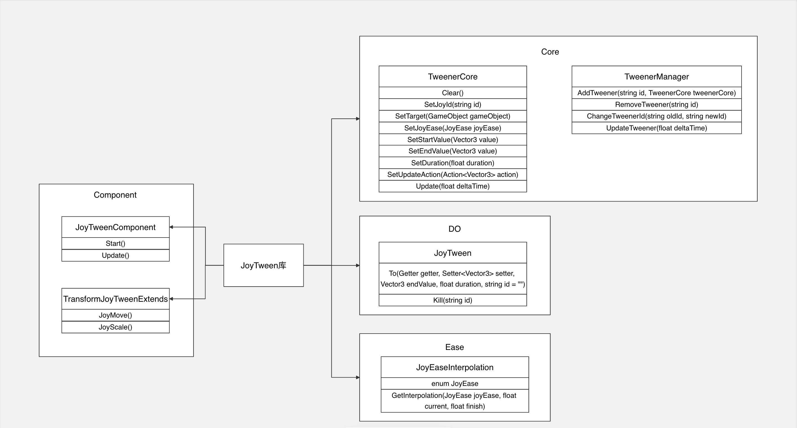

# 实现说明

## JoyTween

在 ```Assets -> JoyTween``` 路径中的文件夹为实现内容

#### 1. 文件结构

JoyTween
1. Component
    1) JoyTweenComponent.cs：放置场景中不销毁的节点脚本
    2) TransformJoyTweenExtends.cs：扩展 Transform 方法
2. Core
    1) TweenerCore.cs：创建每一个 Tween 的核心操作对象
    2) TweenerManager.cs：管理工程内所有 Tween 的管理器
3. DOModule
    1) JoyTween.cs：封装单独使用 Tween 的方法
4. EaseModule
    1) JoyEaseInterpolation.cs：封装使用的 Ease 曲线实现

#### 2. 类图说明



#### 3. 使用说明

1. 销毁 Tween
```C#
    string id = Const.JoyTweenCubeTag;
    JoyTween.Kill(id);
```

2. Transform 调用 DOMove 形式
```C#
    string id = Const.JoyTweenCubeTag;
    Vector3 targetVector = new Vector3(10,10,10);
    float duration = 10f;
    JoyEase ease = JoyEase.Linear;

    JoyTweenCube.transform
            .JoyMove(targetVector, duration)
            .SetJoyEase(ease)
            .SetJoyId(id);
```

3. Transform 调用 DOScale 形式
```C#
    string id = Const.JoyTweenCubeTag;
    Vector3 targetVector = new Vector3(10,10,10);
    float duration = 10f;
    JoyEase ease = JoyEase.Linear;

    JoyTweenCube.transform
            .JoyScale(targetVector, duration)
            .SetJoyEase(ease)
            .SetJoyId(id);
```

4. DOTween.To 的调用形式
```C#
    string id = Const.JoyTweenCubeTag;
    Vector3 targetVector = new Vector3(10,10,10);
    float duration = 10f;

    JoyTween.To(() => JoyTweenCube.transform.localPosition, x => JoyTweenCube.transform.localPosition = x, targetVector, duration, id);
```

5. Ease 使用
```C#
    public enum JoyEase
    {
        Linear,
        InSine,
        OutSine,
        InOutSine,
        InBack,
        OutBack,
        InOutBack,
    }

    JoyTweenCube.transform
            .JoyScale(targetVector, duration)
            .SetJoyEase(JoyEase.Linear)
            .SetJoyId(id);
```

#### 4. 参考说明

1. [Ease曲线图](https://easings.net/)

2. [Ease曲线函数实现](https://github.com/ai/easings.net)